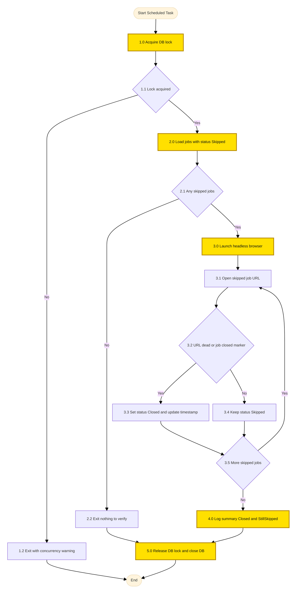

```mermaid
%%{init: {
    "theme": "base",
    "flowchart": {
        "useMaxWidth": false,
        "htmlLabels": true,
        "nodeSpacing": 10,
        "rankSpacing": 40,
        "diagramPadding": 20
    },
    "themeVariables": {
        "fontSize": "10px"
    }
}}%%
graph TD
    start_node([Start Scheduled Task])
    step_1_0[1.0 Acquire DB lock]
    step_1_1{1.1 Lock acquired}
    step_1_2[1.2 Exit with concurrency warning]

    step_2_0[2.0 Load jobs with status Skipped]
    step_2_1{2.1 Any skipped jobs}
    step_2_2[2.2 Exit nothing to verify]

    step_3_0[3.0 Launch headless browser]
    step_3_1[3.1 Open skipped job URL]
    step_3_2{3.2 URL dead or job closed marker}
    step_3_3[3.3 Set status Closed and update timestamp]
    step_3_4[3.4 Keep status Skipped]
    step_3_5{3.5 More skipped jobs}

    step_4_0[4.0 Log summary Closed and StillSkipped]
    step_5_0[5.0 Release DB lock and close DB]
    end_node([End])

    start_node --> step_1_0
    step_1_0 --> step_1_1
    step_1_1 -- "No" --> step_1_2
    step_1_2 --> end_node
    step_1_1 -- "Yes" --> step_2_0

    step_2_0 --> step_2_1
    step_2_1 -- "No" --> step_2_2
    step_2_2 --> step_5_0
    step_2_1 -- "Yes" --> step_3_0

    step_3_0 --> step_3_1
    step_3_1 --> step_3_2
    step_3_2 -- "Yes" --> step_3_3
    step_3_2 -- "No" --> step_3_4
    step_3_3 --> step_3_5
    step_3_4 --> step_3_5
    step_3_5 -- "Yes" --> step_3_1
    step_3_5 -- "No" --> step_4_0

    step_4_0 --> step_5_0
    step_5_0 --> end_node

    classDef x0Step fill:#FFE000,stroke:#B58900,stroke-width:2px,color:#111111;
    classDef normalStep fill:#ECECFF,stroke:#9370DB,stroke-width:1px,color:#333333;

    class step_1_0,step_2_0,step_3_0,step_4_0,step_5_0 x0Step;
    class step_1_1,step_2_1,step_3_2,step_3_5 normalStep;
    class step_1_2,step_2_2,step_3_1,step_3_3,step_3_4 normalStep;
```