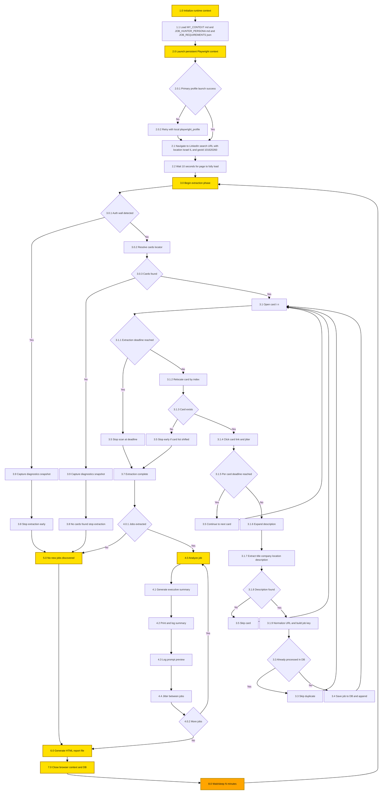

```mermaid
%%{init: {
    "theme": "base",
    "flowchart": {
        "useMaxWidth": false,
        "htmlLabels": true,
        "nodeSpacing": 5,
        "rankSpacing": 20,
        "diagramPadding": 20
    },
    "themeVariables": {
        "fontSize": "10px"
    }
}}%%
graph TD
    step_1_0[1.0 Initialize runtime context]
    step_1_1[1.1 Load MY_CONTEXT md and JOB_HUNTER_PERSONA md and JOB_REQUIREMENTS json]
    step_2_0[2.0 Launch persistent Playwright context]
    step_2_0_1{2.0.1 Primary profile launch success}
    step_2_0_2[2.0.2 Retry with local playwright_profile]
    step_2_1[2.1 Navigate to LinkedIn search URL with location Israel IL and geoId 101620260]
    step_2_2[2.2 Wait 10 seconds for page to fully load]

    step_3_0[3.0 Begin extraction phase]
    step_3_0_1{3.0.1 Auth wall detected}
    step_3_9_auth[3.9 Capture diagnostics snapshot]
    step_3_8_auth[3.8 Stop extraction early]

    step_3_0_2[3.0.2 Resolve cards locator]
    step_3_0_3{3.0.3 Cards found}
    step_3_9_cards[3.9 Capture diagnostics snapshot]
    step_3_8_cards[3.8 No cards found stop extraction]

    step_3_1[3.1 Open card i n]
    step_3_1_1{3.1.1 Extraction deadline reached}
    step_3_5_deadline[3.5 Stop scan at deadline]
    step_3_1_2[3.1.2 Relocate card by index]
    step_3_1_3{3.1.3 Card exists}
    step_3_5_shifted[3.5 Stop early if card list shifted]
    step_3_1_4[3.1.4 Click card link and jitter]
    step_3_1_5{3.1.5 Per card deadline reached}
    step_3_5_next[3.5 Continue to next card]
    step_3_1_6[3.1.6 Expand description]
    step_3_1_7[3.1.7 Extract title company location description]
    step_3_1_8{3.1.8 Description found}
    step_3_5_skip[3.5 Skip card]
    step_3_1_9[3.1.9 Normalize URL and build job key]
    step_3_3{3.3 Already processed in DB}
    step_3_3_skip[3.3 Skip duplicate]
    step_3_4[3.4 Save job to DB and append]
    step_3_7[3.7 Extraction complete]

    step_4_0_1{4.0.1 Jobs extracted}
    step_5_0_none[5.0 No new jobs discovered]
    step_4_0[4.0 Analyze job]
    step_4_1[4.1 Generate executive summary]
    step_4_2[4.2 Print and log summary]
    step_4_3[4.3 Log prompt preview]
    step_4_4[4.4 Jitter between jobs]
    step_4_0_2{4.0.2 More jobs}

    step_6_0[6.0 Generate HTML report file]
    step_7_0[7.0 Close browser context and DB]
    step_8_0[8.0 Wait/sleep N minutes]

    step_1_0 --> step_1_1
    step_1_1 --> step_2_0
    step_2_0 --> step_2_0_1
    step_2_0_1 -- "No" --> step_2_0_2
    step_2_0_2 --> step_2_1
    step_2_0_1 -- "Yes" --> step_2_1
    step_2_1 --> step_2_2
    step_2_2 --> step_3_0
    step_3_0 --> step_3_0_1

    step_3_0_1 -- "Yes" --> step_3_9_auth
    step_3_9_auth --> step_3_8_auth
    step_3_8_auth --> step_5_0_none

    step_3_0_1 -- "No" --> step_3_0_2
    step_3_0_2 --> step_3_0_3
    step_3_0_3 -- "No" --> step_3_9_cards
    step_3_9_cards --> step_3_8_cards
    step_3_8_cards --> step_5_0_none
    step_3_0_3 -- "Yes" --> step_3_1

    step_3_1 --> step_3_1_1
    step_3_1_1 -- "Yes" --> step_3_5_deadline
    step_3_5_deadline --> step_3_7
    step_3_1_1 -- "No" --> step_3_1_2
    step_3_1_2 --> step_3_1_3
    step_3_1_3 -- "No" --> step_3_5_shifted
    step_3_5_shifted --> step_3_7
    step_3_1_3 -- "Yes" --> step_3_1_4
    step_3_1_4 --> step_3_1_5
    step_3_1_5 -- "Yes" --> step_3_5_next
    step_3_5_next --> step_3_1
    step_3_1_5 -- "No" --> step_3_1_6
    step_3_1_6 --> step_3_1_7
    step_3_1_7 --> step_3_1_8
    step_3_1_8 -- "No" --> step_3_5_skip
    step_3_5_skip --> step_3_1
    step_3_1_8 -- "Yes" --> step_3_1_9
    step_3_1_9 --> step_3_3
    step_3_3 -- "Yes" --> step_3_3_skip
    step_3_3_skip --> step_3_1
    step_3_3 -- "No" --> step_3_4
    step_3_4 --> step_3_1

    step_3_7 --> step_4_0_1
    step_4_0_1 -- "No" --> step_5_0_none
    step_4_0_1 -- "Yes" --> step_4_0
    step_4_0 --> step_4_1
    step_4_1 --> step_4_2
    step_4_2 --> step_4_3
    step_4_3 --> step_4_4
    step_4_4 --> step_4_0_2
    step_4_0_2 -- "Yes" --> step_4_0
    step_4_0_2 -- "No" --> step_6_0

    step_5_0_none --> step_6_0
    step_6_0 --> step_7_0
    step_7_0 --> step_8_0
    step_8_0 --> step_3_0

    classDef x0Step fill:#FFE000,stroke:#B58900,stroke-width:2px,color:#111111;
    classDef waitStep fill:#FFA500,stroke:#B58900,stroke-width:2px,color:#111111;
    classDef normalStep fill:#ECECFF,stroke:#9370DB,stroke-width:1px,color:#333333;

    class step_1_0,step_2_0,step_3_0,step_4_0,step_5_0_none,step_6_0,step_7_0 x0Step;
    class step_8_0 waitStep;
    class step_1_1,step_2_0_1,step_2_0_2,step_2_1,step_2_2,step_3_0_1,step_3_9_auth,step_3_8_auth,step_3_0_2,step_3_0_3,step_3_9_cards,step_3_8_cards,step_3_1,step_3_1_1,step_3_5_deadline,step_3_1_2,step_3_1_3,step_3_5_shifted,step_3_1_4,step_3_1_5,step_3_5_next,step_3_1_6,step_3_1_7,step_3_1_8,step_3_5_skip,step_3_1_9,step_3_3,step_3_3_skip,step_3_4,step_3_7,step_4_0_1,step_4_1,step_4_2,step_4_3,step_4_4,step_4_0_2 normalStep;
```