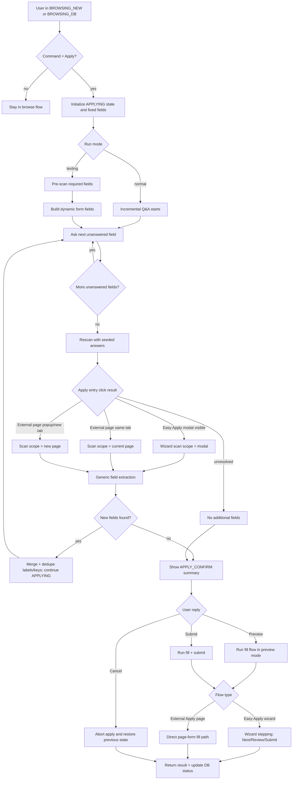

# Flowchart: Telegram Apply State Machine (Dual Apply Paths)

## Notes

- Easy Apply remains wizard-driven and uses modal step progression semantics.
- External Apply flow can be same-tab or popup/new-tab and is scanned as a page form, not a modal wizard.
- Dynamic rescans are answer-seeded so later pages become discoverable.
