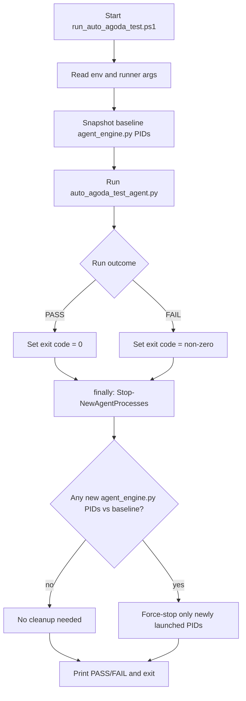

# Flowchart: Auto Test Run And Teardown

## Notes

- Cleanup is guaranteed via `finally` in `run_auto_agoda_test.ps1`.
- Cleanup scope is diff-based: baseline PID snapshot vs post-run process list.
- Existing agent processes from before the run are preserved.
